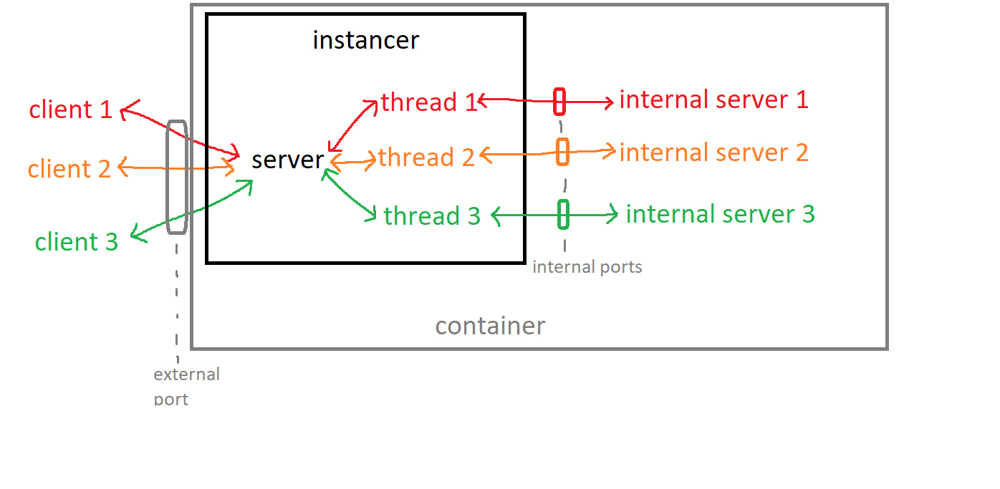

# Instancer
Extensible proxy from outside socket connections to internal socket servers. It creates a separate server instance per connection to prevent interference between connections. It is made with the principle of best simulating a direct client-server connection, so no extraneous data is sent if not necessary.

A user socket Q connects directly to a socket R exposed by the _instancer_ on port A. The instancer then starts a new thread to handle the user's connection, and starts up an instance of the internal server, which exposes an internal socket S on the port B. This thread forwards all data to and from user socket Q and internal socket S, allowing the instancer socket R to act as a proxy.

The instancer uses two main threads:
- One to accept new connections to the server, and assign internal ports to them.
- One to prune existing connections to the server, and free up internal ports.

On the backend, the instancer uses a thread-per-connection system. By default, each thread spins up its own Docker container.
When ports / memory needs to be reclaimed, the oldest threads are culled, and a cleanup function spins down the container.

Out of the box, the instancer uses the following authentication scheme:
- The client first has to send a 130 byte message.
- The first 128 bytes are the authentication token, and the last 2 bytes are the identifier.
- The authentication token is checked against a list of accepted tokens. If it does not match, the connection is dropped.
- If verified, the identifier is then used to identify the instance. Subsequent connections using the same identifier will connect to the same internal server instance. If there are no existing instances associated with the identifier, a new internal server instance is started.
- A special identifier is used to reset all existing instances associated with that authentication token.

This authenication functionality can be extended by modifying the auth.py file.

## Challenge server
The challenge server is containerized with Docker. Build the Docker image then start up a new container using `docker compose up` (in start_cmd.sh)

## Todo
- Add proof-of-work system to prevent excessive connections
- Add ability to blacklist IPs
- Create docker setup, with read only filesystem and setuid binary for internal server
- Dockerise internal server to isolate any exploits run on it. Use Docker API for this.